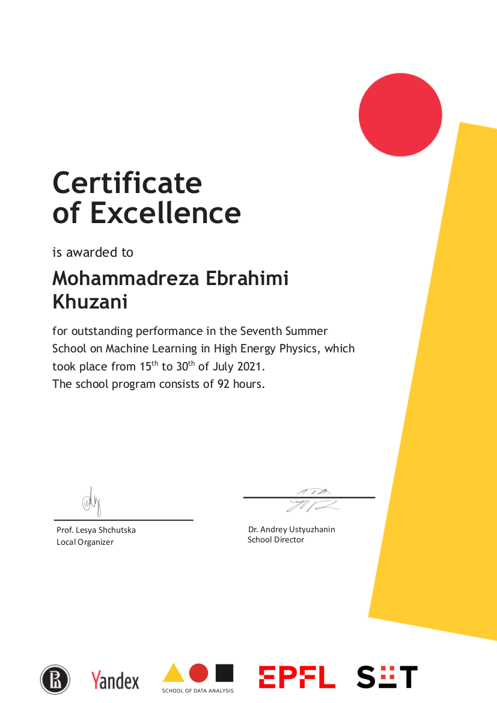

### Curriculum Vitae
***
[Long CV](https://raw.githubusercontent.com/mohammadreza-ebrahimi/mohammadreza-ebrahimi.github.io/main/long-cv/long%20cv.pdf)

### SKILLS

**Programming** 
- ***Python***
  - numpy
  - scipy
  - matplotlib
  - seaborn
  - pandas
  - scikit-learn
  - tensorfow
  - PyTorch
  - sympy
  - einsteinpy
  - gravipy
- Object Oriented Programming
- C/C++
- Shell & Bash scripting
- ***Mathematica***
  - xAct
  - diffgeo
  - quantum
  - GR
  - thermodynamic
- ***Maple***
  - GRtensor 
- Matlab
- Notebook: Jupyter-notebook
- HTML & Markdown 

**Machine Learning & Deep Learning**
- Scikit-learn
> A free software machine learning library for the Python programming language. It features various classification, regression and clustering algorithms including support vector machines, random forests, gradient boosting, k-means and DBSCAN, and is designed to interoperate with the Python numerical and scientific libraries NumPy and SciPy. 
- TensorFlow
> A free and open-source software library for machine learning. It can be used across a range of tasks but has a particular focus on training and inference of deep neural networks. Tensorflow is a symbolic math library based on dataflow and differentiable programming. It is used for both research and production at Google. TensorFlow was developed by the Google Brain team for internal Google use. It was released under the Apache License 2.0 in 2015.  
- PyTorch  
> PyTorch is an open source machine learning library based on the Torch library, used for applications such as computer vision and natural language processing, primarily developed by Facebook's AI Research lab. It is free and open-source software released under the Modified BSD license.

**Data Analyze**  
- ***Python***
  - NumPy
  > A library for the Python programming language, adding support for large, multi-dimensional arrays and matrices, along with a large collection of high-level mathematical functions to operate on these arrays. The ancestor of NumPy, Numeric, was originally created by Jim Hugunin with contributions from several other developers. In 2005, Travis Oliphant created NumPy by incorporating features of the competing Numarray into Numeric, with extensive modifications. NumPy is open-source software and has many contributors. 
  - Pandas
  > In computer programming, pandas is a software library written for the Python programming language for data manipulation and analysis. In particular, it offers data structures and operations for manipulating numerical tables and time series. It is free software released under the three-clause BSD license. The name is derived from the term "panel data", an econometrics term for data sets that include observations over multiple time periods for the same individuals. Its name is a play on the phrase "Python data analysis" itself. Wes McKinney started building what would become pandas at AQR Capital while he was a researcher there from 2007 to 2010.
  - SciPy
  > A free and open-source Python library used for scientific computing and technical computing. SciPy contains modules for optimization, linear algebra, integration, interpolation, special functions, FFT, signal and image processing, ODE solvers and other tasks common in science and engineering. 
- ***C++***
  - ROOT-CERN
   > An open-source data analysis framework used by high energy physics and others. ROOT enables statistically sound scientific analyses and visualization of large amounts of data: today, more than 1 exabyte (1,000,000,000 gigabyte) are stored in ROOT files. The Higgs was found with ROOT!

**Data Visualiziation**  
- ***Python***  
  - Matplotlib
  > A plotting library for the Python programming language and its numerical mathematics extension NumPy. It provides an object-oriented API for embedding plots into applications using general-purpose GUI toolkits like Tkinter, wxPython, Qt, or GTK. There is also a procedural "pylab" interface based on a state machine (like OpenGL), designed to closely resemble that of MATLAB, though its use is discouraged.SciPy makes use of Matplotlib. 
  - Seaborn
  > A Python data visualization library based on matplotlib. It provides a high-level interface for drawing attractive and informative statistical graphics. 
- Maple
- Mathematica

**Version Control Systems (VCS)**  
- Git/GitHub
> Git is a free and open source distributed version control system designed to handle everything from small to very large projects with speed and efficiency. Git is easy to learn and has a tiny footprint with lightning fast performance.

**Operating System**  
- Linux/Unix
- MacOS
- Windows   

- **Certificates**  

  
