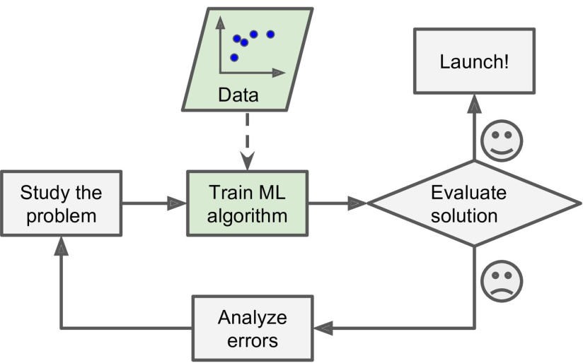
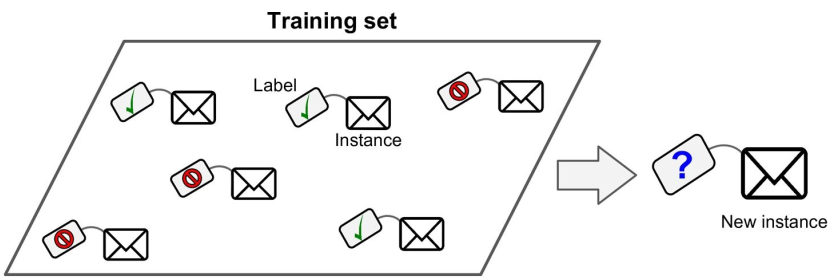
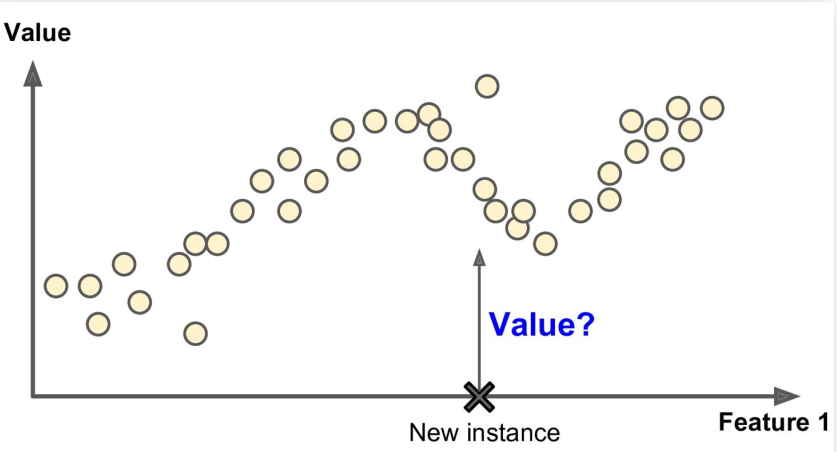
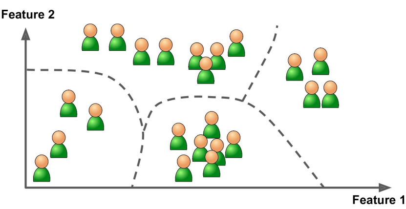
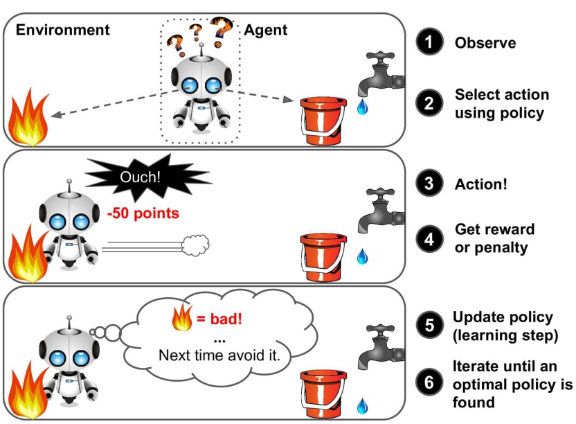

## MACHINE LEARNING

- What is Machine Learning?
- All kinds of Learning
- The first step


### What is Machine Learning?  
Machine learning advented in order to programming getting more easier that before. Actualy, in machine learning you help computer algorithm to improve through data,
after that it does not need to being programmed to do so. These data are called **Trainig data** since by using them, you train an algorithm to do something special, it can be a prediction, calssification or make a decision. let me give an example. Assume you want to develop a program so that it determines that the email which you received, is _spam_ or _not spam_. If you use the old technics, it is required to update it frequently. Because for example, you give the program a keyword like _money_ to say detect it as _spam_, but if they change it to `$`, it would be incapable to detect it. But what machine learning do instead?
In machine learning, you give the computer a data set consists of so many samples of spam email. By these samples, you train the machine what a spam email lookslike. 




But that is not all story, you would be familiar more with machine learning in following. Here you can see the general approach in machine learning.



***
### All kinds of learning
When we are talking about learning, we mean that it may concern with learning to predict something (_label_), to assign(allocate) some data to something else (_label_), or learning so that what to do, what not to do. Based on the explanation, we have three different learning as follows  

- **Supervised Learning**
- **Unsupervised Learning**
- **Reinforcement Learning**

### _Supervised Learning_ 
In supervised learning, the training data you feed to the algorithm includes the desired solutions, called labels (as the email figure <sup>1</sup>).
  - **Classification**  
A typical supervised learning task is classification. The spam filter is a good example of this: it is trained
with many example emails along with their class (spam or ham), and it must learn how to classify new
emails. The labels (target) could be binary (like spam or not) and also multi class. Some other example of binary are: `True` or `False`, `1` or `0`, `yes` or `No`. 
  - **Regression**  
Sometimes you want to predict some thing like _price_, e.g. car price, given a set of features (mileage, age, brand, etc.) called predictors. In these caese, your labels contains a range of numeric values, not binary or multi class. To train the system, you need to give it many examples of cars, including both their predictors and their labels (i.e., their prices).    

Here are some of the most important supervised learning algorithms  
- Linear Regression
- Logistic Regression
- Support Vector Machines (SVMs)
- Decision Trees and Random Forests
- Neural networks
- k-Nearest Neighbors

  

***
### _Unsupervised Learning_  
In unsupervised learning, as you might guess, the training data is unlabeled. The system tries to learn without a teacher. Unsupervised learning is a class of machine learning (ML) techniques used to find patterns in data set. The data given to unsupervised algorithms is not labelled, which means only the input variables (x) are given with no corresponding output variables. In unsupervised learning, the algorithms are left to themselves to discover interesting structures in the data set. 



One of the the best example for this machine learning system is the **Explore** in **Instagram**. After sufficient search, you feed the algorithm some features (most topics which searched), it then classifies them in some categories such as _lifestyle, sport, politic, Fashion, etc_, based on several algorithms. Therefore it would show you the most relevant topics to classified labels.  
Here are some of the most important unsupervised learning algorithms  

- **Clustering**
  - k-Means
  - Hierarchical Cluster Analysis (HCA)
  - Expectation Maximization

- **Visualization and dimensionality reduction**
  - Principal Component Analysis (PCA)
  - Kernel PCA
  - Locally-Linear Embedding (LLE)
  - t-distributed Stochastic Neighbor Embedding (t-SNE)

- **Association rule learning**
  - Apriori
  - Eclat


***  
### _Reinforcement Learning_
Reinforcement Learning is a very different beast. The learning system, called an agent in this context,
can observe the environment, select and perform actions, and get rewards in return (or penalties in the
form of negative rewards). It must then learn by itself what is the best strategy, called a
policy, to get the most reward over time. A policy defines what action the agent should choose when it is
in a given situation. As an example see the following figure <sup>1</sup>



For example, many robots implement Reinforcement Learning algorithms to learn how to walk.
DeepMind’s AlphaGo program is also a good example of Reinforcement Learning: it made the headlines
in March 2016 when it beat the world champion Lee Sedol at the game of Go. It learned its winning
policy by analyzing millions of games, and then playing many games against itself. Note that learning was
turned off during the games against the champion; AlphaGo was just applying the policy it had learned <sup>1</sup>.         


### Requirements
Python  
Integrated Development Environment Software / Python  

**Installation**  
- **Linux**: Iis probably already installed on your system. In oder to check it in your _Terminal_ type  
```
$ python --version
Python 2.7.18
```
Also you will need a number of Python modules: NumPy, Pandas, Matplotlib, and Scikit-Learn, etc. 
```
python3 -c "import matplotlib, numpy, pandas, scipy, sklearn" 
```
There should be no output and no error. To install them, you would need to use Python’s own packaging system, `pip`. You can check to see if it is installed on your system by cammand: `pip3 --version` or `pip --version`.  
```
$ pip3 --version  
pip 20.0.2 from /usr/lib/python3/dist-packages/pip (python 3.8)
```
- **Windows**  
The best way to have it on your own windows, is to utilize [Anaconda](https://www.anaconda.com/) software.
It is free, easy to use and contains several IDEs for python such as Jupyter Notebook, Spyder, PyCharm and ... 
Just choose and download appropriate version for your sytem from this [link](https://www.anaconda.com/products/individual#Downloads).   
It has been released for Linux and MacOs as well.  

_In following I am going to breifly descuss some of the most important modeles that would be applied in a Regression machine learning models_. 


***  
### Regression models tutorial
- **Linear Regression**  
> In statistics, linear regression is a linear approach to modelling the relationship between a scalar response and one or more explanatory variables (also known as dependent and independent variables). The case of one explanatory variable is called simple linear regression; for more than one, the process is called multiple linear regression. This term is distinct from multivariate linear regression, where multiple correlated dependent variables are predicted, rather than a single scalar variable. (From wiki)

  
You can see the coding example in following

```python
from sklearn.linear_model import LinearRegression
import numpy as np

#producing some fake data
np.random.seed(42)  # to reproduce every time the same results.
X = 3 * np.random.rand(200, 1)
# y = \theta_1 + \theta_0 * X + nois
y = 3 + 5 * X + np.random.randn(200, 1)

# Evaluate theta_0 and theta_1 with LinearRegression model
from sklearn.linear_model import LinearRegression

lin_reg = LinearRegression()
lin_reg.fit(X, y)
lin_reg.intercept_, lin_reg.coef_
```
- **DecisionTree and RandomForest Regression/Classification**  
More complex models; These are powerful models, capable of finding complex nonlinear relationships in the data. Assume that data consists of lots of features and instances. In these situations `DecisionTree` and specialy `RandomForest` could be good choices.


[dinhanhthi.com/decision-tree-regression](https://dinhanhthi.com/decision-tree-regression/)


[morioh.com](https://morioh.com/p/2d4243726fdb)

You can see the coding example in following
```python
from sklearn.tree import DecisionTreeRegressor

tree=DecisionTreeRegressor() # for DecisionTree model
tree.fit(X,y)

from sklearn.ensemble import RandomForestRegressor

forest=RandomForestRegressor() # for RandomForest model
forest.fit(X,y)

```


[1]. <font color='gray'>Aurélien Géron - Hands-On Machine Learning with Scikit-Learn and TensorFlow Concepts, Tools, and Techniques to Build Intelligent Systems-O’Reilly Media (2017)</font>
