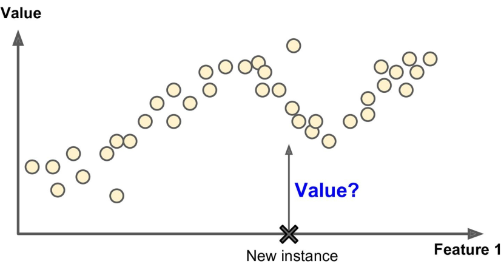

### MACHINE LEARNING

- What is Machine Learning?
- All kinds of Learning
- The first step

#### What is Machine Learning?  
Machine learning advented in order to programming getting more easier that before. Actualy, in machine learning you help computer algorithm to improve through data,
after that it does not need to being programmed to do so. These data are called **Trainig data** since by using them, you train an algorithm to do something special, it can be a prediction, calssification or make a decision. let me give an example. Assume you want to develop a program so that it determines that the email which you received, is _spam_ or _not spam_. If you use the old technics, it is required to update it frequently. Because for example, you give the program a keyword like _money_ to say detect it as _spam_, but if they change it to `$`, it would be incapable to detect it. But what machine learning do instead?
In machine learning, you give the computer a data set consists of so many samples of spam email. By these samples, you train the machine what a spam email lookslike. 

But that is not all story, you would be familiar more with machine learning in following. Here you can see the general approach in machine learning.

***
#### All kinds of learning
When we are talking about learning, we mean that it may concern with learning to predict something (_label_), to assign(allocate) some data to something else (_label_), or learning so that what to do, what not to do. Based on the explanation, we have three different learning as follows  

- **Supervised Learning**
- **Unsupervised Learning**
- **Reinforcement Learning**

#### _Supervised Learning_ 
In supervised learning, the training data you feed to the algorithm includes the desired solutions, called labels (as the email figure).
  - Classification  
A typical supervised learning task is **classification**. The spam filter is a good example of this: it is trained
with many example emails along with their class (spam or ham), and it must learn how to classify new
emails. The labels (target) could be binary (like spam or not) and also multi class. Some other example of binary are: `True` or `False`, `1` or `0`, `yes` or `No`. 
  - Regression  
Sometimes you want to predict some thing like _price_, e.g. car price, given a set of features (mileage, age, brand, etc.) called predictors. In these caese, your labels contains a range of numeric values, not binary or multi class. To train the system, you need to give it many examples of cars, including both their predictors and their labels (i.e., their prices).

