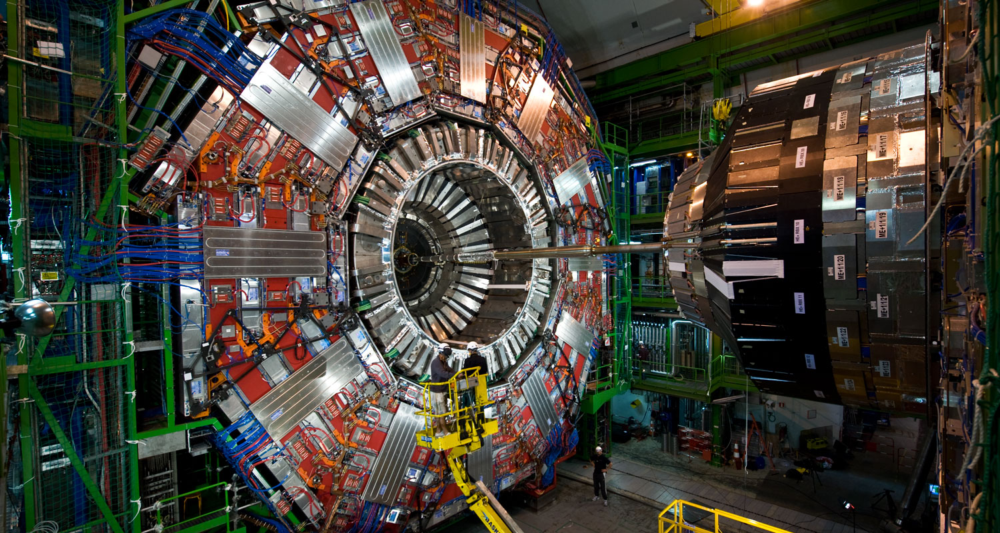
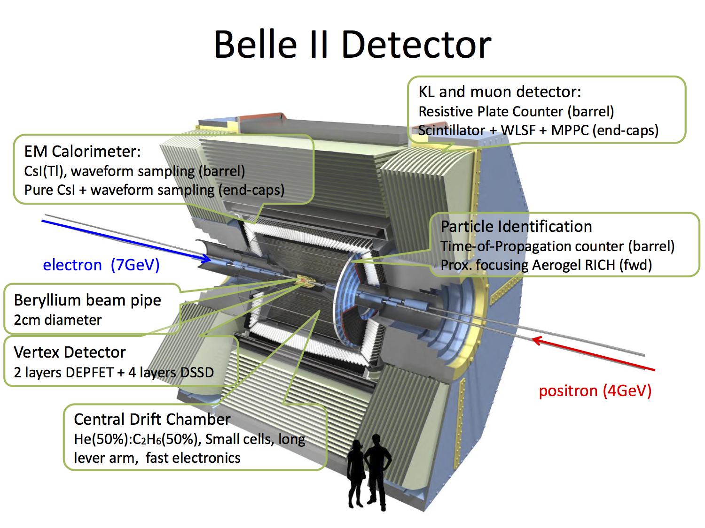
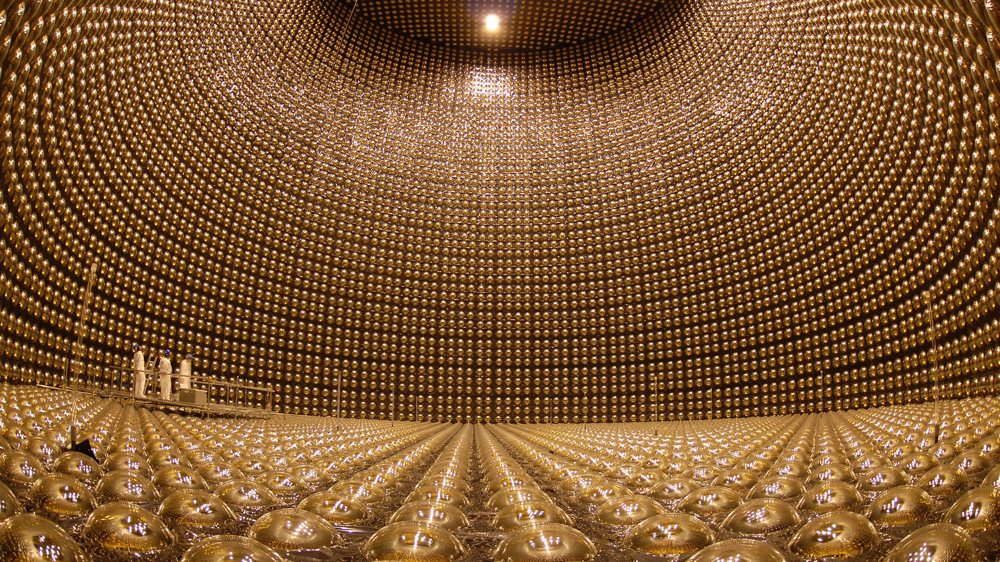
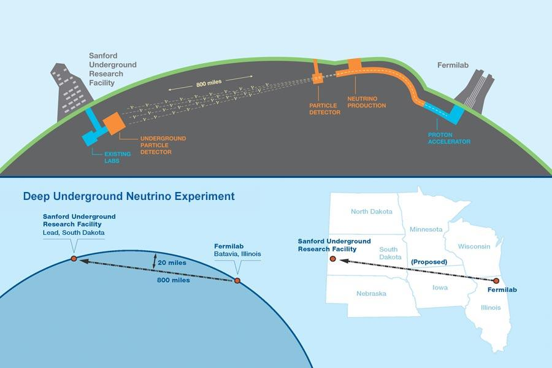

### Experimental Particle Physics  

- **CERN**  
The based method of particle physics labs is acceleration. By accelerating particles to close to the speed of light, the particles collide and then the fundamental 
particle will be detected. That's not such easy, but it is the whole story. More precisely, The instruments used at CERN are purpose-built particle accelerators and 
detectors. Accelerators boost beams of particles to high energies before the beams are made to collide with each other or with stationary targets.
Detectors observe and record the results of these collisions. Now the most powerfull and largest accelerator in the world called Large Hadron Collider or LHC.  

- **LHC**  
The LHC consists of a 27-kilometre ring of superconducting magnets with a number of accelerating structures to boost the energy of the particles along the way. There are strong and professional engineering to establish this interesting collider. It has been built 100 meters under the ground and one of the main characters of LHC is its vacuum which is 10^-9 Pascal approximately. The temperature of the superconductor is 1.9 Kelvin. There should be two beams of the particle in the opposite direction. The energy of the ingoing beams is 450 GeV with 11000 bar/S as well as the magnetic field inside the superconductor which is almost 8.5 Tesla.   
  
This is the accelerator, what about the detectors?  
The beams are made to collide at four locations during this acceleration. These four locations are **ATLAS**, **CMS**, **ALICE**, **LHCb**. In the following you be more familiar with them.   

- **ATLAS**  
ATLAS investigates a wide range of physics. This detector is applied for many purposes, since it is used to search for the Higgs boson and also extra dimensions and particles that could make up dark matter. Beams of particles from the LHC collide at the center of the ATLAS detector making collision debris in the form of new particles, which fly out from the collision point in all directions. Six different detecting subsystems arranged in layers around the collision point record the paths, momentum, and energy of the particles, allowing them to be individually identified. A huge magnet system bends the paths of charged particles so that their momenta can be measured.

The interactions in the ATLAS detectors create an enormous flow of data. To digest the data, ATLAS uses an advanced “trigger” system to tell the detector which events to record and which to ignore. Complex data-acquisition and computing systems are then used to analyse the collision events recorded. At 46 m long, 25 m high and 25 m wide, the 7000-tonne ATLAS detector is the largest volume particle detector ever constructed. It has 46m length, 25m diameter and with mass of 7000t.  

- **CMS**  
It is almost same as the ATLAS experiments but uses different technical solutions and a different magnet-system design. An unusual feature of the CMS detector is that instead of being built in-situ like the other giant detectors of the LHC experiments, it was constructed in 15 sections at ground level before being lowered into an underground cavern near Cessy in France and reassembled. The complete detector is 21 metres long, 15 metres wide and 15 metres high.  

- **Belle II**
> In the big bang, matter and antimatter should have been created in equal amounts. But why is the universe today filled almost only with matter? Physicists attribute the different behaviour of matter and antimatter to the violation of the so-called CP symmetry. This fundamental symmetry of nature states that laws of physics should not change when a particle is interchanged with its antiparticle and the signs of all its spatial coordinates are flipped. Still, the extent of the observed CP violation is not sufficient to explain the actual excess of matter in the universe. The Belle II experiment at the SuperKEKB accelerator in Japan aims to solve this great mystery of particle physics.
  

Very first step after the collision occurs at the Pixel and Silicon Vertex detectors, which are responsible for detection of charged particle path. Next is Central Drift Chamber which ionize the gas fill in the detector and by this, particle trajectory and momentum is obtained. After, they lead to Aerogel RICH counter and TOP counter. In this section, charged particle emits Cherenkov radiation, thereby, the timing and pattern information of detected Cherenkov radiation tell us what kind of particle it is. Next, comes Electromagnetic Calorimeter. This detector is used for precisely measuring the energy of photon and electrons.
The outer most detector is Long-Living neutral Kaon and Muon detector. It detects Muon which penetrates most of the detector.

- **T2K**  
> T2K is a neutrino experiment designed to investigate how neutrinos change from one flavour to another as they travel (neutrino oscillations). An intense beam of muon neutrinos is generated at the J-PARC nuclear physics site on the East coast of Japan and directed across the country to the Super-Kamiokande neutrino detector in the mountains of western Japan. The beam is measured once before it leaves the J-PARC site, using the near detector ND280, and again at Super-K: the change in the measured intensity and composition of the beam is used to provide information on the properties of neutrinos.

- **Deep Underground Neutrino Experiment (DUNE)**  
The Deep Underground Neutrino Experiment (DUNE), a new globally organized endeavor with large international partnerships, grows out of a former neutrino research collaboration known as the Long Baseline Neutrino Experiment (LBNE). The DUNE collaboration, now global, continues to grow, and with 750 scientists, is the largest neutrino experiment collaboration in the world. Based on recommendations from a recent high-energy physics advisory panel, the process of forming a new fully internationalized collaboration to construct the experiment and the Long-Baseline Neutrino Facility (LBNF) in which it will be situated is well underway.  

